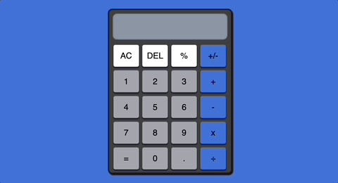

## Calculator

[Try it out for yourself!](https://gavinberetvas.github.io/calculator/)   :point_left:

### Summary 

This was the final assignment in the Odin Project's [Foundations course.](https://www.theodinproject.com/lessons/foundations-calculator)

Coded in HTML5, CSS3, and Vanilla JS/ES6. 

### Features

* All basic arithmetic calculations enabled.
* Swap between a negative and positive number with **[+/-]**.
* Chain functions together without pressing 
**[ = ]** between each function. (e.g. 1 + 1 + 2, 2 x 4 ÷ 8 , etc...).
* Delete a single entry using **[DEL]**.
* Add a decimal point after a number with  **[ . ]**.
(note: Calculator automatically rounds to two decimal points.)
* Create a percentage value to two decimal places using **[ % ]**.
* Reset the calculator by single-clicking the **[AC]** button. 
* Pressing **[ = ]** twice resets the memory ( same as **[AC]** ).

### License

* [MIT License](https://opensource.org/license/mit/)
* Copyright © 2023 Gavin Beretvas

